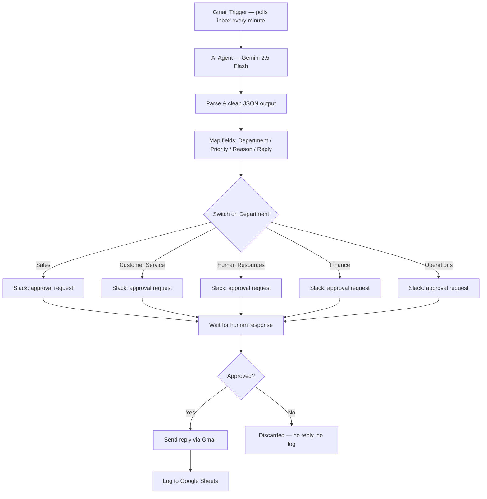

# Email Classification & Response Automation

An AI-driven email triage system that classifies inbound business email by department and priority, drafts a context-aware reply, routes it to the right team for human approval, and logs every decision for auditability — built in n8n with Google Gemini as the reasoning engine.

## The Problem

Inbound business email is a bottleneck: someone has to read every message, figure out which team owns it, decide how urgent it is, and write a response — all before the real work of actually handling the request even starts. Delay on the wrong message (a legal threat, an overdue invoice, a compliance complaint) is where that bottleneck gets expensive.

This workflow removes the triage step, not the human decision. It reads every inbound email, classifies it, and drafts the reply — but nothing reaches a customer until a person on the relevant team approves it.

## How It Works

1. **Trigger** — a Gmail polling trigger checks the inbox every minute for new mail.
2. **Classification & drafting** — the email subject and body are passed to an AI Agent node running Google Gemini 2.5 Flash. A single prompt does two jobs at once: classify the email (department + priority) and draft a complete three-paragraph reply, including an SLA commitment scaled to priority (High → 2 hours, Medium → 24 hours, Low → 3 business days).
3. **Defensive parsing** — LLMs don't always return clean JSON. A Code node strips any stray markdown fences before parsing, so a slightly-off model response doesn't break the workflow.
4. **Routing** — a Switch node sends the email down one of five department branches (Sales, Customer Service, Human Resources, Finance, Operations) based on the AI's classification.
5. **Human-in-the-loop approval** — each branch posts an interactive Slack message to that department's channel, showing the sender, subject, priority, the AI's stated reasoning, and the full proposed reply. A human replies **Approve** or **Reject** directly in Slack.
6. **Conditional send** — only on approval does the workflow send the drafted reply back to the original sender via Gmail.
7. **Audit log** — every approved classification (timestamp, sender, subject, department, priority, reasoning) is appended to a Google Sheet for reporting and quality review.

## Why the Approval Gate Matters

The easy version of this workflow lets the AI send replies straight away. This one doesn't, on purpose. An AI model can misjudge tone, miss context, or occasionally hallucinate a detail — and an email that goes out under "The Support Team" signature can't be unsent. Routing every draft through a human checkpoint before it touches a real inbox keeps the speed benefit of automation without inheriting its failure mode. It's the same instinct that shapes triage in a clinical setting: escalate uncertainty to a person, don't let the system make the final call alone.

## Tech Stack

| Layer | Tool |
|---|---|
| Orchestration | n8n |
| Email trigger & send | Gmail API |
| Classification & drafting | Google Gemini 2.5 Flash (via LangChain node) |
| Human approval | Slack (interactive send-and-wait) |
| Parsing / data shaping | JavaScript (Code node) |
| Audit logging | Google Sheets |

## Screenshots

**Inbound emails (triggers)**

**The workflow in n8n**

**Slack human-in-the-loop approvals**

**Replies sent after approval**

**Audit log**

## Known Limitations & Next Steps

Being upfront about these is part of the engineering — a workflow presented as flawless is less convincing than one with a clear-eyed list of what's next:

- **"Other" classification has no destination.** The Switch node only routes five departments; an email the AI tags as "Other" currently falls through with no Slack notification, no reply, and no log entry. Fix: add a default/fallback output routing to a general triage channel.
- **Rejected emails aren't logged.** The Google Sheets append only happens after an approved send, so a rejected classification leaves no audit trail. Fix: log every classification outcome, approved or not, with a status column.
- **No handling for malformed model output.** If Gemini returns anything the Code node can't parse as JSON, the run fails outright rather than degrading gracefully. Fix: wrap the parse in a try/catch with a fallback "needs manual review" path.
- **No approval timeout.** If nobody responds in Slack, the workflow waits indefinitely. Fix: add a timeout with automatic escalation.
- **No de-duplication check.** Repeated trigger polls could theoretically reprocess the same message. Fix: track processed message IDs.

## Setup

1. Import `Email_Classification_Workflow_JUDE.json` into n8n.
2. Connect credentials: Gmail OAuth2 (trigger + send), Google Gemini API key, Slack OAuth2 (with channel IDs for each department), and a Google Sheets connection to your own tracking sheet.
3. Update the Switch node's department values and the Slack channel IDs to match your own team structure.
4. Activate the workflow — new inbox mail will start flowing through within a minute.

---

Built by **Dr. Chibuzo Jude Mbama** — physician and AI automation engineer, applying the same risk-aware, human-checked design instincts from clinical practice to business process automation.
